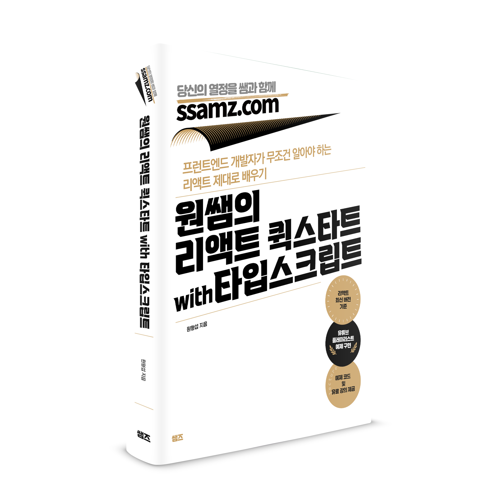

# react-ts-quickstart

### 원쌤의 리액트 퀵스타트 with 타입스크립트 

---

- ch01 : React 소개
- ch02 : ES6와 Typescript 기초
- ch03 : React 시작하기
- ch04 : React 컴포넌트
- ch05 : React 클래스 컴포넌트
- ch06 : React Hook
- ch07 : 고차 함수와 렌더링 최적화
- ch08 : Context API
- ch09 : React Router
- ch10 : 라우팅을 적용한 할일 목록 애플리케이션
- ch11 : axios를 이용한 HTTP 통신
- ch12 : Redux를 이용한 상태관리
- ch13 : React 18 버전

---

## 오탈자, 공지사항
* 오탈자는 [여기](오탈자.MD)를 확인합니다.
